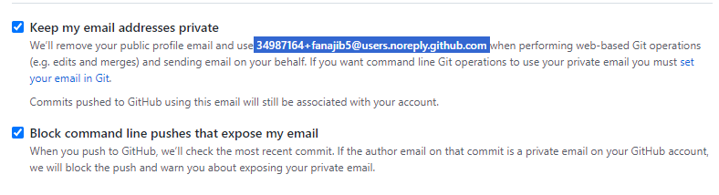
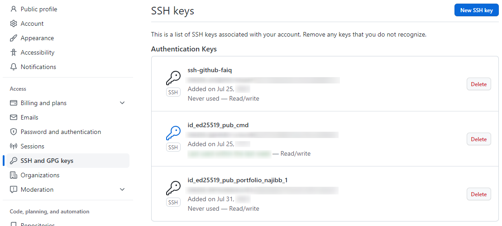

## Introduction

[Git](https://git-scm.com/) is a distributed version control system that is free and open source designed to handle everything from small to very large projects with speed and efficiency.

Meanwhile, [GitHub](https://github.com/about) [is](https://en.wikipedia.org/wiki/GitHub) a complete developer platform and service for building, scaling, and delivering secure software using Git.

## Git Installation

Git installation for Windows is as follows,

<details>
<summary><strong>Windows</strong></summary>

First _download the Git installer_ at [https://git-scm.com/downloads](https://git-scm.com/downloads). Then open that installer.

Follow the [next](https://www.nesabamedia.com/cara-install-git-di-windows-10/) steps. Just click _Next_, make sure it's on _default_, then _next_ again. As usual~~

</details>
<br/>
<details>
<summary><strong>Linux (Ubuntu)</strong></summary>

Perform _update_ and _upgrade_ on the system with the following command:

```bash
sudo apt update && sudo apt upgrade -y
```

Install the Git _package_:

```bash
sudo add-apt-repository ppa:git-core/ppa
sudo apt update
sudo apt install Git
```

Verify the Git version and ensure it's **at minimum** version 2.28[^1]

```bash
git --version
```

</details>
<br/>
<details>
<summary><strong>MacOS</strong></summary>

Follow [these](https://www.theodinproject.com/lessons/foundations-setting-up-git#step-1-install-git) steps hehehe

</details>

## Configure Git and GitHub

### Create a GitHub account

Open [GitHub.com](https://github.com/signup) and create an account! During account setup, an email address will be requested by Git. And it must be a real email. Because contributions will be identified by _default_ by the email that will be used.

Concerns about privacy, or simply not wanting your email address to be known publicly, then you can check two boxes on the Email Settings page after logging into [GitHub account settings](https://github.com/settings/emails):



So, an email like ```34987164+fanajib5@users.noreply.github.com``` will be used for Git configuration.

### Set up Git

For Git to work properly, users must provide information so local Git users can be linked to GitHub. When working in a team, others may see what has been done and who did what on each line of code.

On Windows, the built-in ```Git Bash.exe``` application can be used for Git configuration.

The following command will configure Git. Information inside quotation marks can be replaced with personal information **(but keep the quotation marks)!**

```bash
git config --global user.name "BudiTanpoHutang99"
git config --global user.email "hutangtanpo@budi.id"
```

If using GitHub private email, the configuration would be:

```bash
git config --global user.email "071367+BudiTanpoHutang99@users.noreply.github.com"
```

The _default_ branch on new repositories has been changed by GitHub from ```master``` to ```main```. So, change the default branch for Git using the command:

```bash
git config --global init.defaultBranch main
```

Colorful output with git can be enabled with:

```bash
git config --global color.ui auto
```

The reconciliation behavior of _default branch_ to _merging_ can be set with:

```bash
git config --global pull.rebase false
```

OK! Let's try verifying the results of the Git configuration that has been done:

```bash
git config --get user.name
git config --get user.email
```

### Create SSH keys

SSH keys are cryptographically secure identifiers which are like very long passwords to identify user machines. GitHub uses SSH keys so users don't have to type _username_ and _password_ every time.

On Windows, you can use [PuTTYgen.exe](https://www.ssh.com/academy/ssh/putty/windows/puttygen) or [OpenSSH](https://askme4tech.com/how-configure-ssh-key-based-authentication-windows) to _generate_ [SSH keys](https://phoenixnap.com/kb/generate-ssh-key-windows-10). Then [save](https://docs.digitalocean.com/products/droplets/how-to/add-ssh-keys/create-with-putty/) both the _public key_ and _private key_.

### Link SSH keys with GitHub

First, log in to GitHub and click the profile picture in the upper right corner. Then, click _Settings_ in the _drop-down_ menu.

Next, on the left side, click ```SSH and GPG Keys```. Then, click the ```New SSH key``` button in the upper right corner. Give the SSH key something descriptive enough or any name at all. Leave the GitHub Settings window open for the next step.

Now, copy the **SSH public key** that was just saved (Note that the **.pub file extension** is important in this case.)

Now, return to GitHub in the browser window from earlier and _paste_ the copied key into the _key field_. [Keep the key type](https://nishtahir.com/how-to-enable-ssh-key-verification-with-git-and-github/#adding-your-key-to-github) as ```Authentication Key```, then click ```Add SSH key```. Done! The SSH key has been successfully added!



### Test SSH keys

Follow the instructions in [this GitHub article](https://help.github.com/en/articles/testing-your-ssh-connection) to verify the SSH connection (**Don't forget to remove** ```$``` **when copying code!**). This response can be seen in your terminal: **Hi username! You've successfully authenticated, but GitHub does not provide shell access**. If this message appears, the SSH key was successfully added. If the output doesn't match, try these steps again or [check this reference](https://www.theodinproject.com/lessons/foundations-setting-up-git#step-25-testing-your-key).

## Lessons Learned

Git installation on each OS is quite different, especially Windows which is not equipped with a _Package Manager_. Unlike Ubuntu which has ```apt``` and MacOS with ```brew```.

There is an article discussing that there is an _asymmetric cryptography_ algorithm that is no longer recommended for _generating_ SSH, because it is considered weak. But it seems I forgot to save the _link_ to that article hehehe. Oh! Just found a similar article, [turns out DSA keys](https://thechief.io/c/news/github-is-making-protocol-security-changes-for-ssh-users/).

Thanks to those who stumbled upon this notes section and read it. Hope these notes are useful for you.

That's all. Regards.

[^1]: [Setting Up Git](https://www.theodinproject.com/lessons/foundations-setting-up-git) by The Odin Project.
