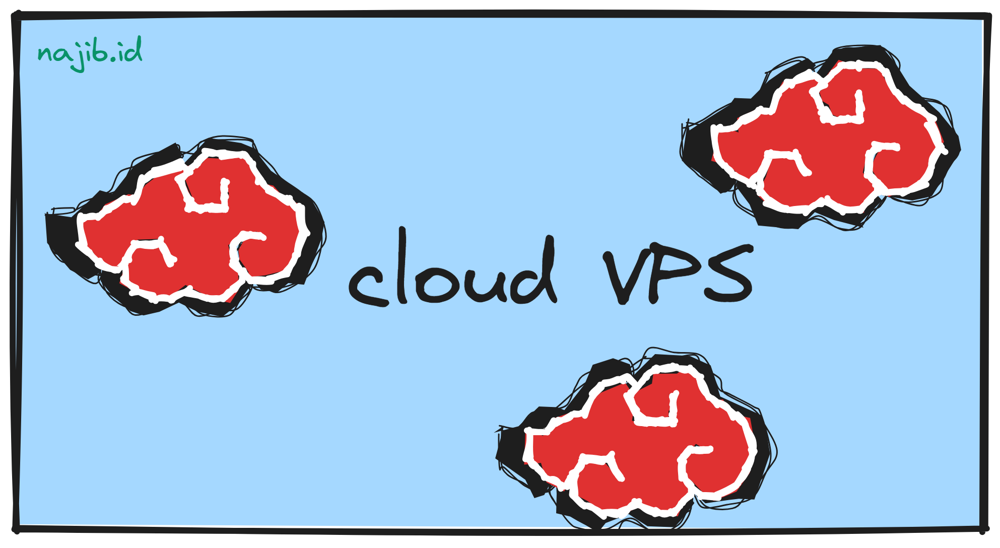
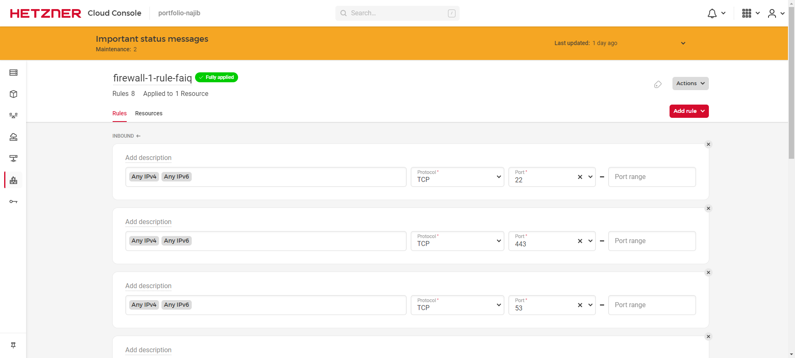

_So anyway_, basically what happened was a few years ago I once randomly ~~just 'cause~~ tried buying [VPS](https://www.hostinger.co.id/tutorial/apa-itu-vps) service from [DigitalOcean](https://www.digitalocean.com/)[^1]. The reason was... none. It was just for fun, why would there need to be a reason hehe~

Short story, that VPS from DO or DigitalOcean didn't even last a month and I already ended it. After several full moons and getting lost here and there[^2], finally my choice fell to [Hetzner](https://www.hetzner.com/)[^1]. A _cloud server_ provider that people said was quite difficult to register for. Turns out, yeah it really was! Hahaha.

Short story, at that time I didn't know anything but was curious following [this tutorial](https://dev.to/styxlab/ghost-cms-on-hetzner-cloud-1dji). It started with the term [Jamstack](https://jamstack.org/) that I just learned about very prematurely which brought me to the question,

> What if _static sites_ could be engineered to still consume dynamic data? <cite>a writer learning web stuff in a haphazard way[^3]</cite>

Without any _fa-fi-fu was-wes-wos_, I immediately registered an account and ~~bought~~ rented a VPS from Hetzner _(the cheapest one of course)_. I diligently followed that tutorial. One by one all obstacles _stretched out, not a problem and won't be a burden on my mind_&mdash;I _googled_ for the solutions as much as possible.

My days were divided between work matters, heart matters&mdash;_ehem_ stomach and the Hetzner server matters. Until one time I followed the whisper in my ear. Yes, I _sulked_/_got mad_/_was sulky_/_was resentful_ and didn't continue that curiosity hahaha.

That Hetzner VPS was finally neglected. Until a strange _email_ came in. The content informed that my billing (_invoices_) address had changed. _Ja*cok_. I just found out what it feels like to get hacked.



Luckily the _support_ team was very responsive when I sent an email to report that incident. They finally replied: "_As your account got hacked and you had no products (except the ones ordered by the hacker) we have cancelled your account._"

Alhamdulillah my online debit was still safe. Turns out various warnings about hard-to-guess password combinations[^4] are indeed true, and very useful.

OK! So basically, my earlier writing had no point and wasn't directly connected to this post hehe.

## Choose and _set up_ VPS

This year, I got back together with Hetzner hehe. Previously, I had already repeated 3 times registering for a Hetzner account whether with the same _email_ or a different _email_ but all were rejected. Well, but everything was resolved after complaining about my old account being _suspended_ due to being hacked. And, _voila_ my account was active again~~

As a result, a [CAX11](https://www.hetzner.com/cloud#pricing) type VPS powered by [Ampere® Altra® processors](https://amperecomputing.com/products/processors) was successfully rented by me. The price, well it's cheap compared to monthly wifi costs.

The VPS was active and I immediately set its configuration and then did _login_.

If on Windows devices, VPS access can be through the [PuTTY](https://www.putty.org/) application. _Download_ and do as usual, _next, next,_ and _next_ until the installation is complete.

### _Login_ to the VPS

After being _installed_ correctly, do the following [steps](https://www.hostinger.com/tutorials/getting-started-with-vps-hosting#2_Log_Into_Your_VPS_Using_Secure_Shell_SSH):

1. Open the PuTTY application.
2. Copy the _IP Address_ from Cloud Console, adjust whether to use ```IPv4```[^5] or ```IPv6```[^5]. Then leave port at ```22```.
3. Paste the _IP Address_ into the column in PuTTY and click the ```Open``` button. Then a _terminal/CMD window_ will appear.
4. [Enter](https://www.digitalocean.com/community/tutorials/how-to-log-into-a-vps-with-putty-windows-users) the _username_ and _password_ from the VPS's ```root``` account. Note that the _password_ typed doesn't appear in the PuTTY terminal.

Besides that, you can also _login_ through _terminal/CMD window_ with the following [steps](https://www.domainesia.com/panduan/cara-remote-vps/#Cara_Remote_Cloud_VPS_via_SSH_melalui_Terminal_Linux):

1. Open terminal and type ```ssh username@ip_address```.
2. Wait a moment and the _terminal_ display will ask to enter the _password_ from the _username_ that will access that VPS.

If using [Ubuntu](https://ubuntu.com/download), then do _update_ and _upgrade_ on the VPS's _package_ with the command:

```bash
sudo apt update
sudo apt upgrade
```

If the VPS asks for confirmation, then type ```-y``` then wait until it's done. Follow if the VPS asks to do a _reboot_.

### _Set up_ VPS _firewall_

On Ubuntu, do the following steps:

1. Allow UFW to be active on the VPS,

   ```bash
   sudo ufw enable
   ```

2. If the VPS returns a response that the _command_ is not recognized, then _install_ first,

   ```bash
   sudo apt-get install ufw
   ```

3. If already _installed_, then do the first step again.
4. Check _firewall_ status,

   ```bash
   sudo ufw status
   ```

5. Add _rules_ according to [what is needed](https://www.digitalocean.com/community/tutorials/how-to-set-up-a-firewall-with-ufw-on-ubuntu-20-04).

### _Set up_ applications according to what is needed

Because basically this VPS will be used as a _hosting_ place for projects so they can be _demo_-ed for personal portfolio purposes, then several applications or _packages_ will be _installed_.

Because there was no sure guide and just in case, I _installed_ lots of _packages_ and applications hahaha.

#### LEMP _stack_

The _stack_ used in the coding world, mainly _websites_, as far as I know (without data okay!) is LAMP and LEMP.

[LAMP](https://www.digitalocean.com/community/tutorials/how-to-install-linux-apache-mysql-php-lamp-stack-on-ubuntu-18-04#introduction) stands for Linux, Apache, MySQL, PHP. While [LEMP](https://www.digitalocean.com/community/tutorials/how-to-install-linux-nginx-mysql-php-lemp-stack-on-ubuntu-22-04#introduction) stands for Linux, Nginx, MySQL, PHP.

Coincidentally, I `~~**randomly again**~~ chose this LEMP _stack_. Oh forgot, there was a reason _ding_. This VPS I had already planned as a subdomain of this website, which is [```portfolio.najib.id```](https://portfolio.najib.id) hehehe. _Anyway_, here are the steps.

##### _Install_ NGINX _web server_

_Update_ the VPS first and **can** add ```-y``` to directly confirm _packages_ that will be _updated_.

```bash
sudo apt update -y
```

Then, continue _installing_ [NGINX](https://www.digitalocean.com/community/tutorials/how-to-install-linux-nginx-mysql-php-lemp-stack-on-ubuntu-22-04#step-1-installing-the-nginx-web-server).

```bash
sudo apt install nginx -y
```

After NGINX installation is complete and ```ufw``` is already allowed from the previous step, next check which applications can be entered into the ```ufw``` _rule_.

```bash
sudo ufw app list
```

The output displayed by the VPS, **more or less** like the following,

```bash
Output
Available applications:
  Nginx Full
  Nginx HTTP
  Nginx HTTPS
  OpenSSH
```

Allow port ```80``` which by _default_ is the port that accepts [HTTP access](https://dewabiz.com/port-yang-digunakan-web-server/).

```bash
sudo ufw allow 'Nginx HTTP'
```

Check again the status on ```ufw```.

```bash
sudo ufw status
```

The output will **more or less** be like the following

```bash {linenos=false,hl_lines=[7,9]}
Output
Status: active

To                         Action      From
--                         ------      ----
OpenSSH                    ALLOW       Anywhere
Nginx HTTP                 ALLOW       Anywhere
OpenSSH (v6)               ALLOW       Anywhere (v6)
Nginx HTTP (v6)            ALLOW       Anywhere (v6)
```

Check the NGINX configuration results in the _browser_ by entering ```http://ip_address``` or ```domain_qoeh.com```. The result is the writing _Welcome to nginx!_.

##### _Install_ MariaDB RDBMS

Because it was still in close time, could directly _install package_ MariaDB without having to do _update package_ first.

```bash
sudo apt install mariadb-server
```

Make sure MariaDB is already running.

```bash
sudo systemctl start mariadb.service
```

Then, do configuration on MariaDB.

```bash
sudo mysql_secure_installation
```

Adjust the _prompt_ with [what is needed](https://www.digitalocean.com/community/tutorials/how-to-install-mariadb-on-ubuntu-20-04#step-2-configuring-mariadb).

Next, I chose the option to add a _user_ other than _root_.

```bash
sudo mariadb
```

After entering the ```MariaDB&nbsp;[(none)]>``` _prompt_, create that new _user_ and set its _privilege_.

```bash
GRANT ALL ON *.* TO 'budi'@'localhost' IDENTIFIED BY 'BudiTanpoHutang619' WITH GRANT OPTION;
```

Do _flush privileges_ to ensure the new _user_ configuration.

```bash
FLUSH PRIVILEGES;
```

OK! Exit from MariaDB _prompt_

```bash
exit
```

##### _Install_ PHP

Do [PHP installation](https://www.digitalocean.com/community/tutorials/how-to-install-linux-nginx-mysql-php-lemp-stack-on-ubuntu-22-04#step-3-installing-php) with the version according to what is needed.

```bash
sudo apt install php8.1-fpm php-mysql
```

##### Configure NGINX to use PHP

First, create a web _root_ directory with the desired domain, for example is [```portfolio.najib.id```](https://portfolio.najib.id) as the _folder_ name.

```bash
sudo mkdir /var/www/portfolio.najib.id
```

Set directory ownership with ```$USER```.

```bash
sudo chown -R $USER:$USER /var/www/portfolio.najib.id
```

Then, create NGINX configuration in the ```sites_available``` directory through ```nano```.

```bash
sudo nano /etc/nginx/sites-available/portfolio.najib.id
```

In the newly created domain configuration _file_, fill with content like the following.

```bash {linenos=false,hl_lines=["3-23"]}
# located at /etc/nginx/sites-available/portfolio.najib.id

server {
    listen 80;
    server_name portfolio.najib.id www.portfolio.najib.id;
    root /var/www/portfolio.najib.id;

    index index.html index.htm index.php;

    location / {
        try_files $uri $uri/ =404;
    }

    location ~ \.php$ {
        include snippets/fastcgi-php.conf;
        fastcgi_pass unix:/var/run/php/php8.1-fpm.sock;
     }

    location ~ /\.ht {
        deny all;
    }

}
```

Done changing, exit from ```nano``` editor with ```CTRL + X``` then ```Y``` to confirm saving the changed file, and press ```ENTER```.

Create a _symbolic link_ from that directory.

```bash
sudo ln -s /etc/nginx/sites-available/portfolio.najib.id /etc/nginx/sites-enabled/
```

Disconnect the _symbolic link_ of the _default_ configuration.

```bash
sudo unlink /etc/nginx/sites-enabled/default
```

Then check the configuration by testing it.

```bash
sudo nginx -t
```

If successful, will appear results like the following. If not successful, means there is port ```80``` from other configuration that is also _'pulled'_ by NGINX.

```bash
nginx: the configuration file /etc/nginx/nginx.conf syntax is ok
nginx: configuration file /etc/nginx/nginx.conf test is successful
```

_Restart_ NGINX to apply configuration changes.

```bash
sudo systemctl reload nginx
```

Create the initial page of the _website_ when _IP Address_ or _domain_ is accessed.

```bash
nano /var/www/portfolio.najib.id/index.html
```

Fill the ```index.html``` file example like this

```html
<html>
<!-- /var/www/portfolio.najib.id/index.html -->

  <head>
    <title>portfolio.najib.id website</title>
  </head>

  <body>
    <h1>Hello World!</h1>

    <p>This is the landing page of <strong>portfolio.najib.id</strong>.</p>
  </body>

</html>
```

Check the results in the _browser_ by entering ```http://ip_address``` or ```domain_qoeh.com```.

#### PostgreSQL Database

_Install package_ [PostgreSQL](https://www.digitalocean.com/community/tutorials/how-to-install-postgresql-on-ubuntu-22-04-quickstart) with the following command.

```bash
sudo apt install postgresql postgresql-contrib
```

That installation will create a _user_ with the name ```postgres``` with root _role_ on PostgreSQL.

When wanting to create a new _user_ or _role_, then can use the following command.

```bash
sudo -u postgres createuser --interactive
```

And will appear ```prompt``` on the _terminal_ that can be filled according to needs.

```bash {linenos=false,hl_lines=[1]}
Output
Enter name of role to add: sammy
Shall the new role be a superuser? (y/n) y
```

#### MongoDB Database

First, enter the ```GPG``` public key through the ```curl``` command.

```bash
curl -fsSL https://www.mongodb.org/static/pgp/server-4.4.asc | sudo apt-key add -
```

Continue by registering the MongoDB _package_ to ```apt```. Here I only use the ```arm64``` option which adjusts to the type of _processor_ which is ARM64.

```bash
echo "deb [ arch=arm64 ] https://repo.mongodb.org/apt/ubuntu focal/mongodb-org/4.4 multiverse" | sudo tee /etc/apt/sources.list.d/mongodb-org-4.4.list
```

Update the _package_ on ```apt```.

```bash
sudo apt update
```

Only then _install_ MongoDB.

```bash
sudo apt install mongodb-org
```

Run the MongoDB _service_.

```bash
sudo systemctl start mongod.service
```

And, check the _status_ of MongoDB.

```bash
sudo systemctl status mongod
```

Give permission to MongoDB to run when the VPS is on.

```bash
sudo systemctl enable mongod
```

Test MongoDB connection.

```bash
mongosh --eval 'db.runCommand({ connectionStatus: 1 })'
```

The output obtained is like the following. Here I use ```mongosh``` because the ```mongo``` command is not detected by the VPS.

```bash
Current Mongosh Log ID: 64c94ce4a0986579ea215006
Connecting to:          mongodb://127.0.0.1:27017/?directConnection=true&serverSelectionTimeoutMS=2000&appName=mongosh+1.10.2
Using MongoDB:          6.0.8
Using Mongosh:          1.10.2

For mongosh info see: https://docs.mongodb.com/mongodb-shell/

------
   The server generated these startup warnings when booting
   2023-07-31T08:50:33.805+00:00: Using the XFS filesystem is strongly recommended with the WiredTiger storage engine. See http://dochub.mongodb.org/core/prodnotes-filesystem
   2023-07-31T08:50:34.751+00:00: Access control is not enabled for the database. Read and write access to data and configuration is unrestricted
   2023-07-31T08:50:34.751+00:00: vm.max_map_count is too low
------

{
  authInfo: { authenticatedUsers: [], authenticatedUserRoles: [] },
  ok: 1
}
```

## _Troubleshooting_

For _database_ connection needs _remotely_ from personal devices, can do connection settings through ```bind_address=0.0.0.0``` and set the _firewall_. There are lots of tutorials on Google hehehe.

In this condition, I got an error that _remote_ database connection couldn't be done even though the configuration was already according to what exists on the internet. Turns out the solution that must be done is to set the _firewall_ on the Hetzner _console dashboard_ **also**. That's for Hetzner, I don't know how other _cloud providers_ are.

For example on the link [https://console.hetzner.cloud/projects/9922305/firewalls/199524/rules](https://console.hetzner.cloud/projects/9922305/firewalls/199524/rules), this is just an example link.



## Lessons That Can Be Taken

OK! Purchasing or renting VPS/_cloud_ service is quite _tricky_ because it could be the _provider_ only gives _gimmick_ and not the real results promised. That is according to accounts from several _threads_ from the [LowEndTalk](https://lowendtalk.com/) forum. Friends can search for themselves from that forum.

Installing _packages_ on VPS has different commands. Because it depends on the _flavors_ of the Linux OS itself. If Ubuntu _distro_ uses ```apt```, then maybe it will be different with other _distros_.

The VPS root _password_ can be _reset_ from the VPS _provider_ account's _console dashboard_.

And, Hetzner seems to have a layered _firewall_, starting from its _console dashboard_ and the _firewall_ on the VPS itself. Whether I lack knowledge or lack of tinkering with VPS myself, but that was my impression hehe.

My reason for using NGINX is at the same time as a _reverse proxy_ because my main _domain_ is already through [Netlify](https://netlify.com) which _serves_ the static [website](https://najib.id). While NGINX will act to _route_ when the _subdomain_ [portfolio.najib.id](https://portfolio.najib.id) is accessed by internet users. That was my plan, at least according to information and knowledge I got from Google hehe.

Thank you to those who wandered into this notes _section_ and read it. Hopefully these notes are useful for you.

That's all. Greetings.

[^1]: _Links_ don't contain _referral_ codes.
[^2]: Unique [website](https://lowendbox.com/) [forum](https://lowendtalk.com/) that I just found, until VPS [comparison](https://www.vpsbenchmarks.com/) site.
[^3]: Haphazard learning is... hmm... seems when _googling_, there's no clear explanation. But, I once found a post on LinkedIn (sorry again, I forgot to save that post) that discussed that haphazard learning is knowledge learned not in order and taken from various sources without definite teacher guidance. More or less like that as I remember hehe.
[^4]: Password combinations considered _Good_ according to [article](https://security.harvard.edu/use-strong-passwords#block-boxes-1574263848) from Harvard University are combinations of uppercase letters, lowercase letters, numbers and symbols. For example, ```budi@TanpoHutang619```.
[^5]: [The difference](https://www.trivusi.web.id/2022/09/mengenal-ipv4-dan-ipv6.html) [is](https://pandi.id/blog/mengenal-ipv4-dan-ipv6), IPv4 is the old version _IP Address_ which is usually used until now even when this post was written. While IPv6 is a newer type of _IP Address_. It needs to be noted that not all internet/wifi providers in Indonesia provide IPv6, so choose VPS wisely :)
